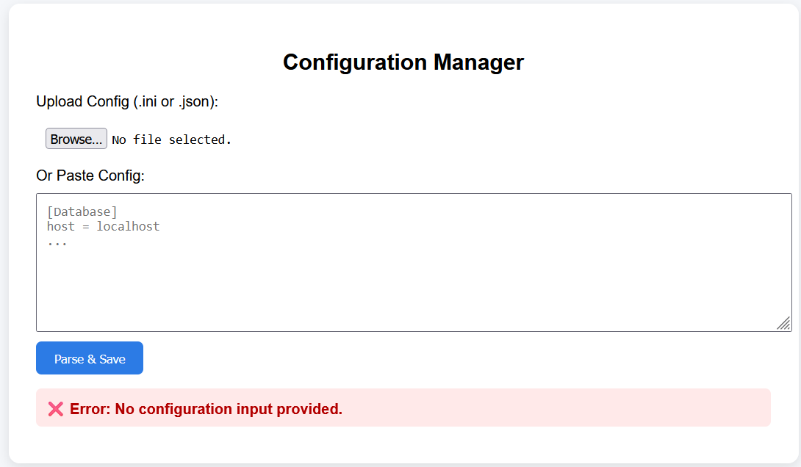

# ⚙️ Configuration Manager

A powerful web-based configuration management tool built using **Flask**. This tool allows users to upload or paste configuration files in `.ini` or `.json` formats, parse and view them in a user-friendly format, edit them in-browser, and export the updated configurations. It also stores the latest configuration in a **SQLite** database for easy retrieval and updates.

---

## 🌟 Features

- 📁 **Upload or Paste Config**: Accepts both `.ini` and `.json` formats
- 🧾 **Parse & View Configurations**: Converts raw config into a structured editable table
- ✏️ **Edit in Browser**: Modify key-value pairs directly in the UI
- 💾 **SQLite Storage**: Automatically saves parsed configurations to a local SQLite database
- ⬇️ **Export Config**: Download configuration as `.ini` or `.json`
- 🔌 **REST API Support**: Get or update configuration via endpoints

---

## 📁 Project Structure
```
config-manager/ 
            ├── app.py # Flask application 
            ├── templates/ 
            │ └── index.html # HTML interface 
            ├── database.db # SQLite database (auto-created on first run) 
            └── uploads/ # Directory for uploaded config files


```
## 🧰 Requirements

- Python 3.6 or higher
- Flask

### Install dependencies:

pip install flask

### Getting Started

git clone https://github.com/sainathislavath/config_parser.git

cd config_parser

### Run the application

python app.py

### Open in web browser

http://127.0.0.1:5000/

## 🌐 Web Interface Usage

### 🔼 Upload or Paste Config

- Upload a `.ini` or `.json` configuration file using the file input, **OR**
- Paste the configuration content directly into the textarea provided.

### 🔍 Parse & View

- After submission, the parsed configuration will appear as editable tables grouped by their respective sections.

### 💾 Save & Edit

- Modify any values directly in the editable fields.
- Click the **Save Changes** button to update and persist the configuration in the SQLite database.

### ⬇️ Export

- Use the **Export as INI** or **Export as JSON** buttons to download the latest version of your configuration in your preferred format.


